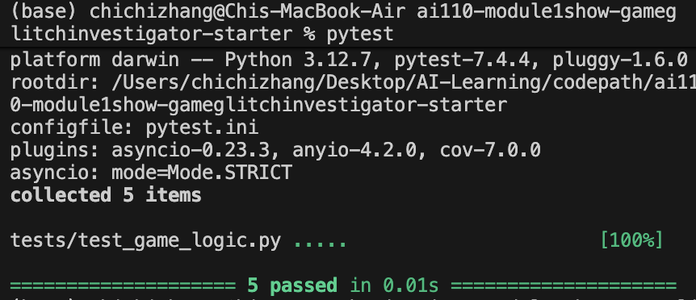

# 🎮 Game Glitch Investigator: The Impossible Guesser

## 🚨 The Situation

You asked an AI to build a simple "Number Guessing Game" using Streamlit.
It wrote the code, ran away, and now the game is unplayable.

- You can't win.
- The hints lie to you.
- The secret number seems to have commitment issues.

## 🛠️ Setup

1. Install dependencies: `pip install -r requirements.txt`
2. Run the broken app: `python -m streamlit run app.py`

## 🕵️‍♂️ Your Mission

1. **Play the game.** Open the "Developer Debug Info" tab in the app to see the secret number. Try to win.
2. **Find the State Bug.** Why does the secret number change every time you click "Submit"? Ask ChatGPT: _"How do I keep a variable from resetting in Streamlit when I click a button?"_
3. **Fix the Logic.** The hints ("Higher/Lower") are wrong. Fix them.
4. **Refactor & Test.** - Move the logic into `logic_utils.py`.
   - Run `pytest` in your terminal.
   - Keep fixing until all tests pass!

## 📝 Document Your Experience

### Refactoring

The core logic of the game was refactored from `app.py` into `logic_utils.py` to improve modularity and testability. This included functions like `get_range_for_difficulty`, `parse_guess`, `check_guess`, and `update_score`. This change made the code cleaner and easier to maintain.

### Debugging and Testing

Bugs were identified and fixed, such as the history board not clearing on "New Game" and incorrect hint messages. Automated tests were added in `tests/test_game_logic.py` to validate these fixes. Manual testing was also performed using Streamlit to ensure the app behaved as expected.



### Collaboration with AI

AI tools were used to refactor code, identify bugs, and suggest fixes. While some suggestions required adjustments, the collaboration significantly improved productivity and code quality. For example, AI suggested moving logic to `logic_utils.py` and provided a starting point for test cases.

## 📸 Demo

To run the game locally, follow these steps:

1. Install the required dependencies:

   ```bash
   pip install -r requirements.txt
   ```

2. Start the Streamlit app:

   ```bash
   python -m streamlit run app.py
   ```

3. Open the app in your browser at the URL provided by Streamlit (usually `http://localhost:8501`).

Enjoy the guessing game and test your skills!

---

## 🚀 Stretch Features

- [ ] [If you choose to complete Challenge 4, insert a screenshot of your Enhanced Game UI here]
